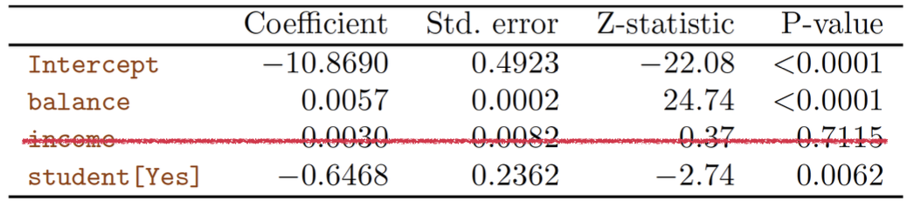

# **Classification**

## **Linear Regression**
Unlike regression problem, classification could be applied for categorical problem.

When we use the regression problem at measuring probability, some problems are accured.

For example, in expression

$$
P(Y=1|X) = \beta_0 + \beta_1X
$$

There will be some negative value or value over one of probability. So it's not compative for estimate probability.

## **Logistic Regression**

To compensate for the disadvantages of linear regression, we could use **Logistic Regression**

$$
P(Y = 1 | X) = \frac{e^{\beta_0 + \beta_1X}}{1 + e^{\beta_0 + \beta_1X}}
$$

As you can see, in this expression we use sigmoid function for classification.

### **Then how we could estimate the regression coefficients?**

In logistic regression, we use **maximum likelihood** estimation function.

$$
\ell(\beta_0, \beta_1) = \prod_{i:y_i=1}p(x_i) \prod_{i^\prime:y_{i^\prime}=0}(1 - p(x_i^\prime))
$$

This expression means like this;

We could estimate $\beta_1$ and $\beta_0$ which maximize the probability of $x_i$ which has label 1 is estimated as they have label 1 (first part) and so on.

### **Interpretation**

* If $\beta_1 = 0 $, there is no relationship between X and Y

* If $\beta_1 > 0 $, when X increases, $P(Y=1|X)$ will increases

* If $\beta_1 < 0 $, when X increases, $P(Y=1|X)$ will decreases.

### **Hypothesis test**

We use $\hat\beta_1$ and $SE(\hat\beta_1)$ to calculate the z-statistic:

$$
z = \frac{\hat\beta_1 - 0}{SE(\hat\beta_1)}
$$

And with **z-statistic**, we could calculate **P-value**.

When **P-value** is small enough, we could reject null hypothesis.

## **Multiple Logistic Regression**

Multiple Logistic Regression is similar with **Simple Logistic Regression**.

Multiple Logistic Regression also use **maximum likelihood** method.

### **Points to be careful about**

In Multiple Logistic Regression, we have to be careful about understanding **correlation of predictor $X_i$ and probability $Y$**.

Here is a example of this.

In this table, we get coefficients of multiple logistic regression to predict a probability of default.

According to this table it's easy to confuse that a student is less likely to default than a non-student.

But it's not correct. To understand the coefficients' mean correctly, we have to fix the other predictors' value.

So in this case, **when client have the same balance**, a student is less likely to default than a non-student client.
