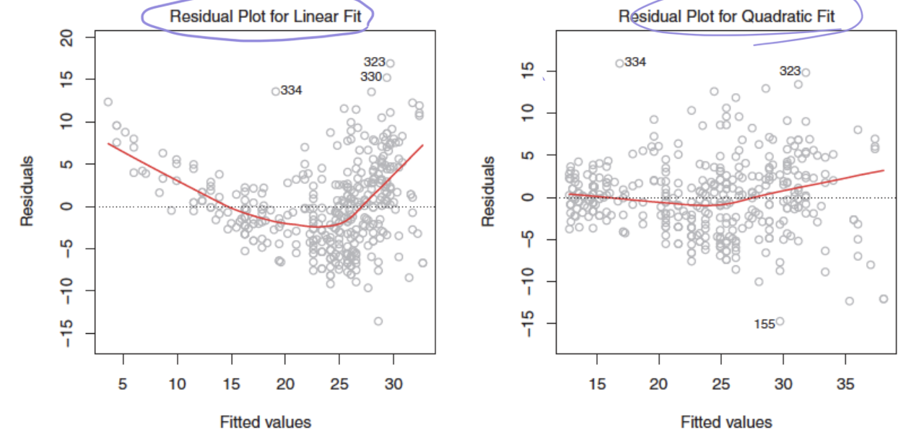

# Multiple Linear Regression
If there are number of $ p $ predictors in a model,

Multiple Linear Regression model looks like this expression below : 

$$
Y = \beta_0 + \beta_1X_1 + \beta_2X_2 + ... + \beta_pX_p + \epsilon
$$

In this expression, $ \beta_j $ means the average effect on $ Y $ by predictor $ X_j $

## Measure of accuarncy in Multiple Linear Regression model

$$
RSE = \sqrt{\frac{1}{n-p-1}RSS}
$$

In this expression, $ n-p-1 $ is known as degrees of freedom

$$
R^2 = 1 - \frac{RSS}{TSS}
$$

# Other considerations

## Interaction effects

In real world, one variable could change the effectiveness of other variable.

### Modified Model

We could consider multiplication of two predictor as unique predictor

$$
\begin{align}
Y &= \beta_0 + (\beta_1 + \beta_3X_2)X_1 + (\beta_2)X_2 \\
&= \beta_0 + \beta_1X_1 + \beta_2X_2 + \beta_3(X_1X_2)
\end{align}
$$

> #### Some problem
>**Q**. If an iteraction term($ X_1X_2 $) has a very small p-value(good for prediction), but single predictors($ X_1 $) does not, What should we do?
>
>**A**. We should also include single predictors even if the p-values are not significant

## Non linear regression

It is possible to use squared predictor as one unique predictor of regression model.

$$
Y = \beta_0 + \beta_1X_1 + \beta_2X_1^2 + \epsilon
$$

>### cf) Residual plot
>We use residual plot to visuallize how the model is powerful.
>
>
>
>In this plot, Quadratic Fit is more powerful then Linear Fit

# Conclusion of Linear Regression

1. **Plot the samples**
2. **Check p-value**(Are the predictors significant enough?)
3. **Check $ R^2 $** (Is there significant increase?)
4. **Check Residual plot**
