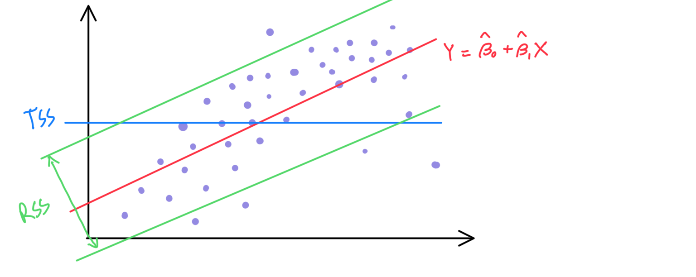

# **Simple Linear Regression**

In the following expression when we regress $Y$ onto $X$

$$ Y \approx \beta_0 + \beta_1X $$

$Y$ is true value, $X$ is a predictor, $\beta_0$ is intercept and $\beta_1$ is slope.

By Training Data, we can train the simple linear regression model looks like this; $\hat{y} = \hat{\beta_0} + \hat{\beta_1}x $

## **How to train**

To train the model, we have to find $\beta_1$ and $\beta_0$ which could minimize the RSS(Residual sum of squares)

> ### **Residual Sum of Squares**
> Residual could be breifly understood as error of prediction
>
> *i* th residual can be represented like this; $e_i = y_i - \hat{y_i}$
>
>So, Residual sum of squares is 
>
>$$ RSS = \sum_{i=1}^{n} e_i^2 = \sum_{i=1}^{n}(y_i -\hat{\beta_0} - \hat{\beta_1}x_i)^2$$

## **How to check the accuracy of our model**
Because we trained the model to minimize the RSS in our train dataset, when the train dataset changes, model will also changed.

So we use **Standard Error** to measure how estimate varies under repeated sampling.

### **Standard Error**
There are three values which affect Standard Error
- sample size ($n$)
- Variation of sample ($\sum_{i=1}^n(x_i - \bar x)^2$)
- Varience of irreducible error ($\sigma ^2$)

Standard Error of intercept and slope are represented like this
$$SE(\hat\beta_0)^2 = \sigma^2[\frac1n+ \frac{\bar x^2}{\sum_{i=1}^n(x_i - \bar x)^2}]$$
$$SE(\hat\beta_1)^2 =\frac {\sigma^2} {\sum_{i=1}^n(x_i - \bar x)^2}$$

So we can see that
1. The larger the sample size, the lower SE is.
2. The larger the variation of sample, the lower SE is.
3. Ther lagrger the varience of irreducible error, the higher SE is.

## **Hypothesis test**

By using standard errors we could guess is there a relationship between $X$ and $Y$
- Null hypothesis ($H_0$)

    If $H_0$, this means there is no relationship between $X$ and $Y$
    $$ H_0: \beta_1(slope) = 0$$

- Alternative hypothesis ($H_a$)

    If $H_a$ this means there is some relationship between $X$ and $Y$

### **t-statistic & p-value**
We can check the probability of null hypothesis by t-statistic.

t-statistic depends on two values

1. t-statistic is proportional to $\hat{\beta_1} - 0$
2. t-statistic is inversly proportional to 
$SE(\hat\beta)$ (standard error of $\hat\beta$)

So we can calculate t-statistic by this expression

$$ t = \frac {\hat{\beta_1} - 0}{SE(\hat\beta)} $$

By t-statistic value, we could calculate p-value which represent the probability of $\hat{\beta_1}$ is 0.

> **With small p-value, we could reject the null hypothesis**

## **Accurancy of the Model**
### **Residual Standard Error(RSE)**

$$ RSE = \sqrt{\frac{1}{n - 2}RSS}$$

By Residual Standard Error, we could estimate how well the model fits with dataset.

### **$R^2$ statistic**

$$ R^2 = \frac{TSS - RSS}{TSS} $$

TSS(Total Sum of Squares) is $\sum(y_i-\bar y)^2$.

So $R^2$ measures the proportion of variability in $Y$ that can be explained using $X$

RSS will always less or equal to TSS so $R^2$ is in range of 0 to 1.

> When one model's $R^2$ is closer to one then other model, it means that model is more useful then the others.